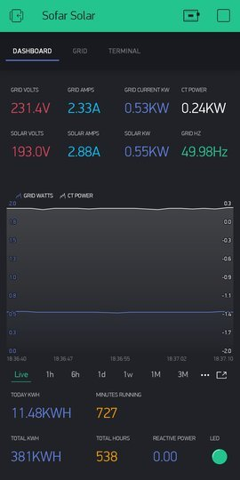
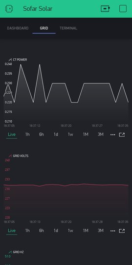
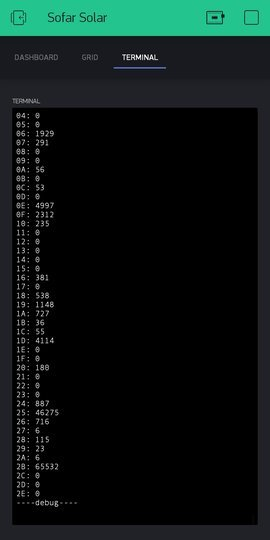
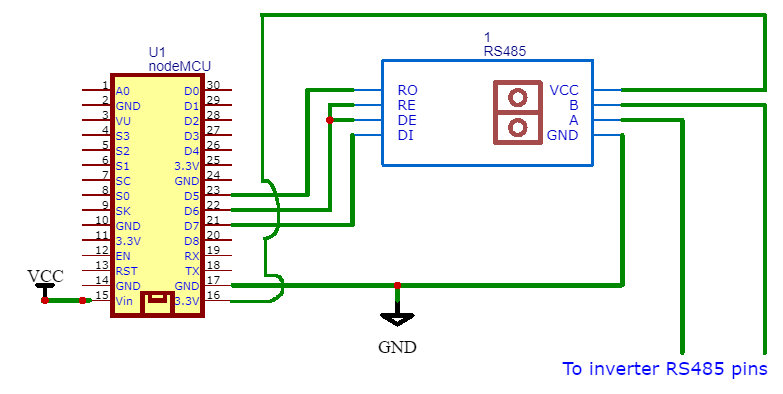

# sofar_solar
A project that logs data from sofar solar on-grid inverter and sends the data to the blynk server using RS485 modbus interface.
## Images

## Hardware requirements:
- On-Grid Solar Powerplant with Sofar inverter (I am using Sofar 2700TL-G3 inverter)
- NodeMCU (or any other ESP8266 based microcontroller)
- Max485 module
- Twisted pair cable
- Power supply
## Diagram

## Software requirements:
- Arduino IDE configured to program ESP8266 based microcontrollers
- Stable Wifi network
- Local Blynk server (Recommended) (https://github.com/blynkkk/blynk-server/releases)
- Legacy Blynk apk (Blynk IoT is not support local server) (https://m.apkpure.com/blynk-%D0%B0%D1%80%D0%B4%D1%83%D0%B8%D0%BD%D0%BE-esp8266-rpi/cc.blynk/download/2279830-APK-fcf9f2854d5eae5cdefe298431479280?from=versions%2Fversion)
- Inverter datasheet for registry related details ([Here's my inverter's registry details for reference](https://github.com/dibg/sofar_solar/blob/main/Registry_Details.pdf))
### NOTE: The registry information varies slightly for every sofar inverter. So one either needs to get the exact datasheet of the inverter from the manufacturer or just guess what information each registry holds using the above pdf as reference.
### Libraries required:
- [ModbusMaster](https://github.com/4-20ma/ModbusMaster) for communicating with Modbus slaves over RS232/485 (via RTU protocol).
- [Blynk](https://github.com/blynkkk/blynk-library) for communicating with the Blynk server.

Original project creator: [4llonsy](https://github.com/4llonsy/sofar_solar)